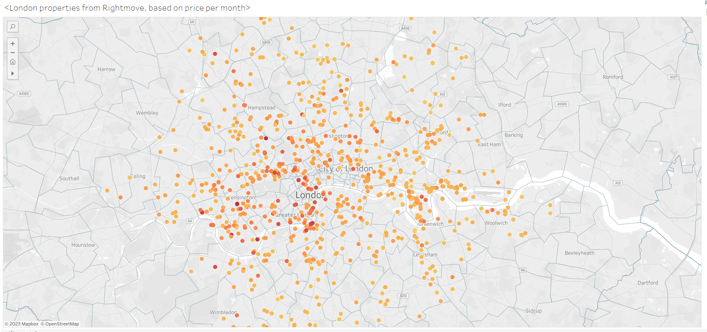
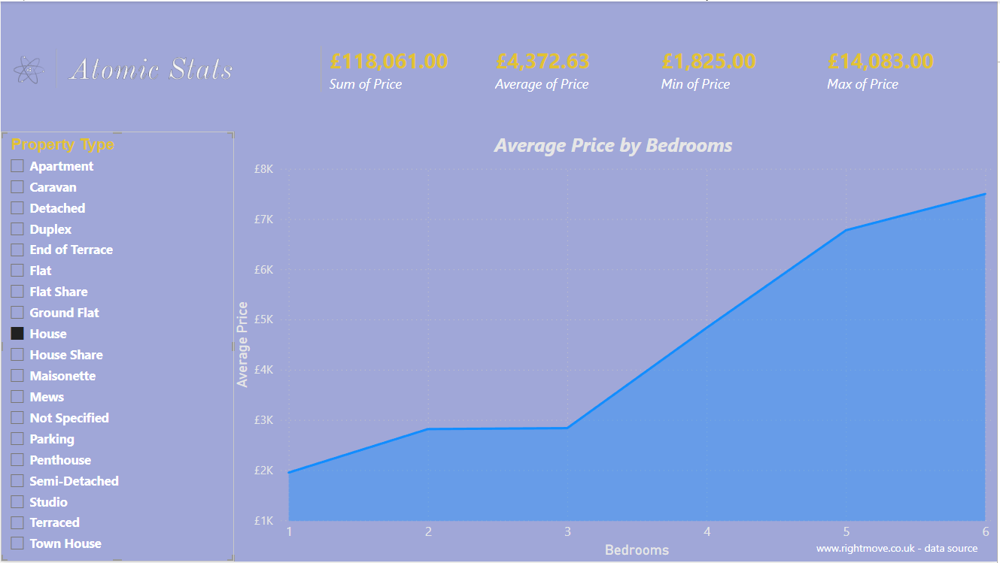
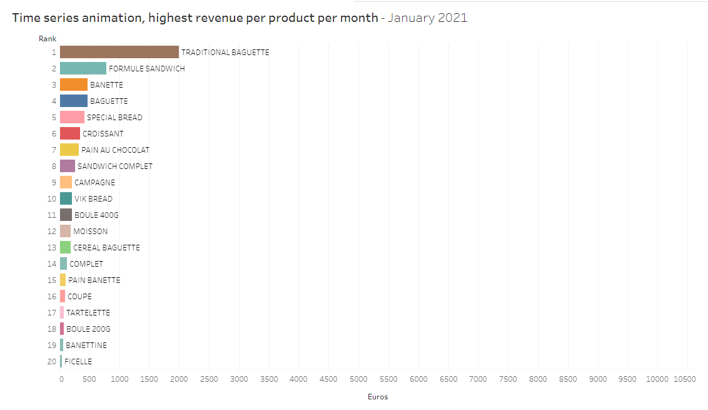
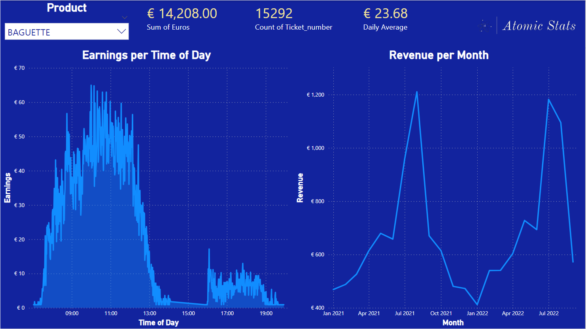

# George’s Portfolio

### [Rightmove London Rent Prices Analysis](https://github.com/georgehorgan/Rightmove-properties)

Within this project I:

- Built a web scraper in Python to collect data on a thousand properties in London.
- Cleaned and processed the data in Python using NumPy and Pandas.
- Analysed and queried the data in PostgreSQL.
- Used GoogleMaps API in Python to return X,Y co-ordinates given addresses as input.
- Visualised the data in Tableau to show data in the form of a map:

Full version: [Tableau Viz](https://public.tableau.com/app/profile/george.horgan/viz/LondonpropertiesfromRightmovefilteredbypricepermonth/Sheet1)

- Created a PowerBI dashboard:

### [French Bakery Analysis](https://github.com/georgehorgan/French_Bakery)

A small business looking to improve profits by learning about the trends of their market. 

The bakery had been collection data for 21 months and I’m tasked with answering the stakeholders questions and showcasing the answers to them:

Time series analysis:

Full version: [Tableau Time Series Viz](https://public.tableau.com/app/profile/george.horgan/viz/French_bakery_series/TimeSeries)

PowerBI dashboard for the stakeholders:

### [An Analysis on Europe](https://github.com/georgehorgan/Europe-Project)

Within this all-python project I:

- Imported data from many difference sources.
- Cleaned and processed the data ready for analysis using NumPy and Pandas.
- Performed EDA whilst visualising the results in Python using Matplotlib and Seaborn.
- Created a regression analysis and k-means clustering to further show relationships in the data.
